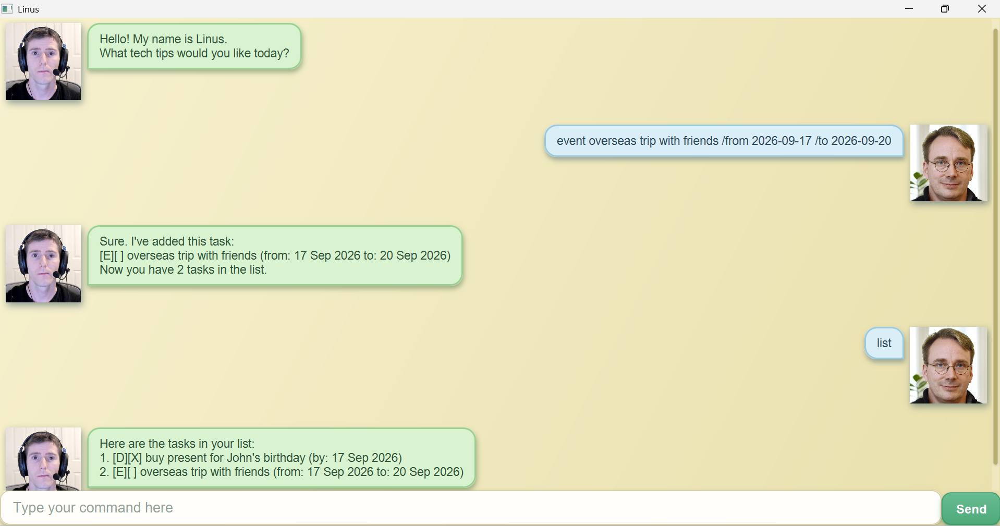

# Linus User Guide



Introducing Linus, your friendly chatbot who is always ready to assist and provide some tech tips!
Linus helps you to keep track of all your tasks so you never forget a task or miss an important deadline or event! 

## Table of Contents
### 1. Task Types
### 2. Command List
### 3. Add Todo Task
### 4. Add Deadline Task
### 5. Add Event Task
### 6. Delete Task
### 7. Mark Task
### 8. Unmark Task
### 9. Find Task
### 10. List Tasks
### 11. Exit Program


## Task Types
Linus currently supports 3 main task types - Todo, Deadline and Event. All 3 task types have an identifier, completion 
status as well as a description. Tasks that are completed are represented by "[X]", while tasks that are incomplete are 
represented by "[ ]"
* Todo: A Todo task represents a task to be completed without any deadlines or period to be completed by. Todo tasks 
are uniquely identified by their descriptions and do not have deadline, start or end date fields. Todo tasks have the "[T]"
identifier. (2 Todo tasks are the same if they have the same description) E.g. `[T][X] arrange for consultation`
* Deadline: A Deadline task represents a task to be completed by a specified deadline. Deadline tasks have the "[D]"
identifier, a completion status, task description as well as a deadline to be completed by. Deadline tasks do not have a
start or end date and are uniquely identified by both the description and the deadline. (2 Deadline tasks are the same 
if they have the same description and deadline). E.g. `[D][ ] submit homework (by: 1 Jan 2026)`
* Event: An Event task represents a task that starts at a specified start date and ends at a specified end date. Event 
tasks have the "[E]" identifier, a completion status, task description, start date and end date. Event tasks do not have 
a deadline date and are uniquely identified by its task description, start date and end date. (2 Event tasks are the 
same if they have the same description, start date and end date) E.g. `[E][X] attend roadshow (from: 1 Jan 2026 to: 
2 Jan 2026)`

## Command List

The set of supported commands are listed below with a brief description, general format and example usage. Please refer
to the individual sections below for further information on each command.

* `todo`: Adds a Todo task to the tasklist with the specified description E.g. `todo sleep`
* `deadline`: Adds a Deadline task to the tasklist with the specified description and deadline
  E.g. `deadline complete homework /by 2026-01-09`
* `event`: Adds an Event task to the tasklist with the specified description, start and end date
  E.g. `event attend seminar /from 2026-01-09 /to 2026-01-10`
* `delete`: Removes the task at the specified position from the tasklist. E.g. `delete 1`
* `mark`: Marks the task at the specified position as completed. E.g. `mark 1`
* `unmark`: Marks the task at the specified position as incomplete. E.g. `unmark 1`
* `find`: Lists all the tasks in the taskList whose description contains the keyword. E.g. `find concert`
* `list`: Lists all the tasks currently in the tasklist.
* `bye` : Bye command used to exit and close the program.

## Add Todo Task

When prompted, Linus will create a new Todo task with the given description and add it to the end of the tasklist. Newly
created Todo tasks are incomplete by default. Upon successful execution, a confirmation message containing the newly 
created Todo task will be displayed together with the updated number of tasks in the tasklist.

Command Format: todo **_description_** on an initial tasklist:

1. \[T]\[X] eat dinner

Example Usage: `todo buy gifts`

```
Sure. I've added this task:
[T][] buy gifts
Now you have 2 tasks in the list.
```

## Add Deadline Task

When prompted, Linus will create a new Deadline task with the given description and deadline and add it to the end of 
the tasklist. Newly created Deadline tasks are incomplete by default. Upon successful execution, a confirmation message 
containing the newly created Deadline task will be displayed together with the updated number of tasks in the tasklist.
**Deadline dates must be supplied in the format** `yyyy-MM-dd`

Command Format: deadline **_description_** /by **_deadline_**

Example Usage: `deadline submit assignment /by 2026-01-01` on an initial tasklist:

1. \[T]\[X] buy gifts

```
Sure. I've added this task:
[D][] submit assignment (by: 1 Jan 2026)
Now you have 2 tasks in the list.
```

## Add Event Task

When prompted, Linus will create a new Event task with the given description, start date and end date and add it to the 
end of the tasklist. Newly created Event tasks are incomplete by default. Upon successful execution, a confirmation 
message containing the newly created Event task will be displayed together with the updated number of tasks in the 
tasklist. **Both start date and end date must be supplied in the format** `yyyy-MM-dd`

Command Format: event **_description_** /from **_start date_** /to **_end date_**

Example Usage: `event attend exhibition /from 2026-01-01 /to 2026-01-02` on an initial tasklist:

1. \[T]\[X] buy gifts

```
Sure. I've added this task:
[E][] attend exhibition (from: 1 Jan 2026 to: 2 Jan 2026)
Now you have 2 tasks in the list.
```

## Delete Task

When prompted, Linus will find the task in the tasklist with the given index and remove it from the
tasklist. The remaining tasks that were after the deleted task move up the tasklist by 1 position. Upon successful 
execution, a confirmation message containing the deleted Event task will be displayed together with the updated number
of tasks in the tasklist. **The task index provided must be a positive integer smaller than the total number of tasks
in the tasklist (between 1 and total number of tasks in tasklist)**

Command Format: delete **_index_**

Example Usage: `delete 1` on an initial tasklist:

1. \[T]\[X] buy gifts
2. \[D]\[ ] submit assignment (by: 1 Jan 2026)

```
Noted. I've removed this task:
[T][X] buy gifts
Now you have 1 task in the list.
```

## Mark Task

When prompted, Linus will find the task in the tasklist with the given index and mark it as completed. The updated task 
will now be marked as complete represented by "\[X\]" for its completion status. Upon successful
execution, a confirmation message containing the newly marked task will be displayed. 
**The task index provided must be a positive integer smaller than the total number of tasks
in the tasklist (between 1 and total number of tasks in tasklist)**

Command Format: mark **_index_**

Example Usage: `mark 1` on an initial tasklist:

1. \[T]\[ ] buy gifts

```
Yay!. I've marked this task as done:
[T][X] buy gifts
```

## Unmark Task

When prompted, Linus will find the task in the tasklist with the given index and mark it as incomplete. The updated task
will now be marked as incomplete represented by "\[ \]" for its completion status. Upon successful
execution, a confirmation message containing the newly unmarked task will be displayed.
**The task index provided must be a positive integer smaller than the total number of tasks
in the tasklist (between 1 and total number of tasks in tasklist)**

Command Format: unmark **_index_**

Example Usage: `unmark 1` on an initial tasklist:

1. \[T]\[X] buy gifts

```
Fine, I've marked this task as not done yet:
[T][ ] buy gifts
```

## Find Task

When prompted, Linus will display all the tasks in the tasklist that contain the given keyword in its description. 
Each task that contains the keyword will be displayed with its **original position in the tasklist.**
**The keyword provided must not be empty.**

Command Format: find **_keyword_**

Example Usage: `find buy` on an initial tasklist:

1. \[T]\[X] buy gifts
2. \[T]\[ ] arrange consult
3. \[T]\[ ] buy laptop

```
Here are the matching tasks in your list:
1. [T][X] buy gifts
3. [T][ ] buy laptop
```

## List Tasks

When prompted, Linus will display all the tasks in the tasklist in the order in which the tasks were added. Newly added
tasks are added at the bottom of the tasklist, while deleted tasks will no longer show up in the tasklist and cause all
tasks that were added after it to move up the tasklist by 1 position.


Command Format: list

Example Usage: `list` on an initial tasklist:

1. \[T]\[X] buy gifts
2. \[T]\[ ] arrange consult
3. \[T]\[ ] buy laptop

```
Here are the tasks in your list:
1. [T][X] buy gifts
2. [T][ ] arrange consult
3. [T][ ] buy laptop
```

## Exit Program

When prompted, Linus will close and the program will exit.

Command Format: bye

Example Usage: `bye`

### Let Linus manage your tasks today!